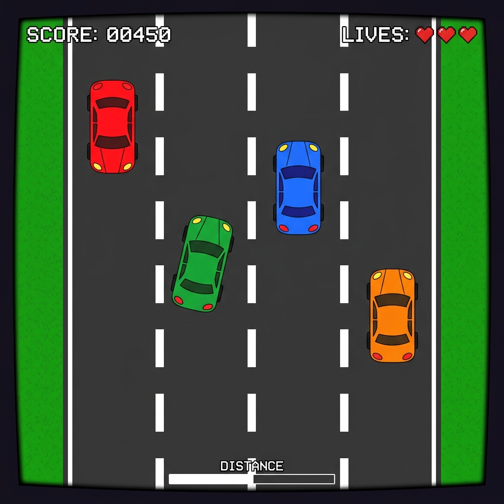
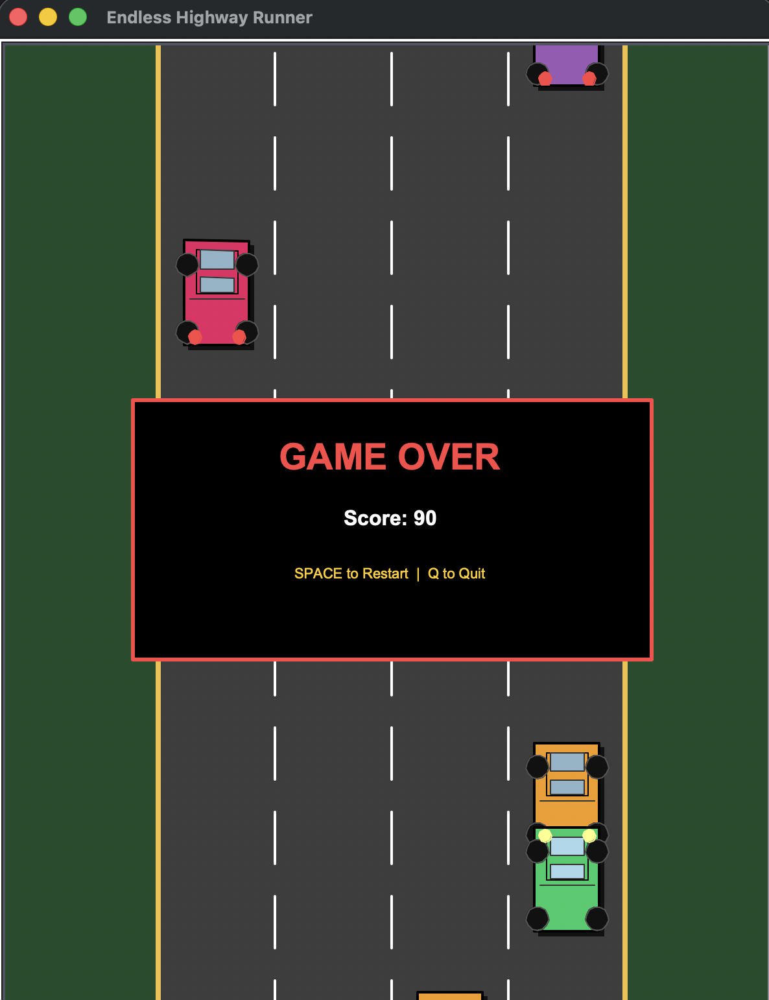

# Endless Highway Runner using Python Turtle

A high-performance 2D arcade-style **Endless Highway Runner** game built entirely with **Python Turtle Graphics**. This project is designed to demonstrate **Computer Graphics fundamentals**, including the **Bresenham Line Algorithm**, real-time animation, collision detection, and interactive game mechanics.

---

## 🎮 Project Overview

**Endless Highway Runner** is a lane-based 2D car dodging game developed as an academic project for Computer Graphics. It simulates a high-speed driving environment where the player must navigate through traffic, survive as long as possible, and achieve the highest score.

### Key Gameplay Mechanics:
* **Endless Scrolling**: The highway moves continuously, simulating high-speed travel.
* **Lane-Based Movement**: The player can switch between 4 distinct lanes to avoid traffic.
* **Dynamic Difficulty**: The game speed and enemy spawn frequency increase as the score rises.
* **Collision Detection**: Real-time bounding-box logic ends the game upon impact.

---

## ✨ Features

* 🚀 **Endless Scrolling Highway**: Smooth, vertically scrolling road with dashed lane dividers.
* 🏎️ **Player-Controlled Vehicle**: Responsive car movement with lane-snapping logic.
* 🚗 **AI Traffic System**: Randomly spawning enemy cars with randomized colors.
* 📈 **Score Tracking**: Real-time HUD displaying the current score and current speed.
* ⚡ **Speed Scaling**: Game gradually becomes faster, testing reflexes.
* 🔄 **Restart & Quit**: Quick state reset using the Spacebar and exit using 'Q'.
* 🎨 **Premium Visuals**: Clean, object-based rendering with shadows and lighting details.

---

## 🛠️ Technologies Used

* **Python 3**: Core programming language.
* **Turtle Graphics**: Used for all rendering and event handling.
* **Time & Random Modules**: For animation timing and procedural enemy generation.

---

## 📐 Concepts & Algorithms

### Computer Graphics Fundamentals
* **2D Coordinate System**: Precise object placement and movement.
* **Object-Based Rendering**: Every game element (cars, road, HUD) is drawn as a discrete object.
* **Real-Time Screen Refresh**: Optimized using `tracer(0)` and `update()` for flicker-free animation.

### Implemented Algorithms
* **Bresenham Line Algorithm**: Used for drawing road borders, lane dividers, and vehicle details with high efficiency.
* **Primitive Construction**: Custom functions for drawing rectangles and circles with fills and outlines.
* **2D Transformations**: 
    * *Translation*: Moving cars and scrolling road.
    * *Scaling*: Proportional vehicle design (body, roof, windows).

---

## 📸 Gameplay Screenshots

| Highway Scene | Game Over State |
| :---: | :---: |
|  |  |

---

## 📂 Project Structure

```bash
Endless-Highway-Runner/
│
├── endless_highway_runner.py   # Main game source code
├── README.md                   # Project documentation
└── screenshots/                # Gameplay screenshots
    ├── gameplay.png
    └── gameover.png
```


---

## ⌨️ User Controls

| Key | Action |
| :--- | :--- |
| **Left Arrow** | Move car one lane left |
| **Right Arrow** | Move car one lane right |
| **Up Arrow** | Increase game speed |
| **Down Arrow** | Decrease game speed |
| **Space** | Restart game (after Game Over) |
| **Q** | Quit the game |

---

## 🎓 Academic Relevance

This project was developed for a **Computer Graphics Lab** course to showcase:
1. Practical implementation of **Bresenham’s Line Algorithm**.
2. Event-driven programming and interactive graphical UI.
3. Optimization of rendering loops in a constrained environment (Turtle Graphics).
4. Procedural generation of game objects.

---

## 🚀 How to Run

1. Ensure you have **Python 3** installed.
2. Clone this repository or download the source code.
3. Run the following command in your terminal:

```bash
python endless_highway_runner.py
```

---

## 👨‍💻 Author

**Fateha Hossain Anushka**  
Computer Science & Engineering  
*Computer Graphics Lab Project*